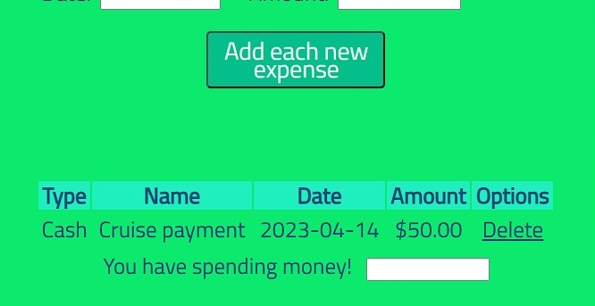
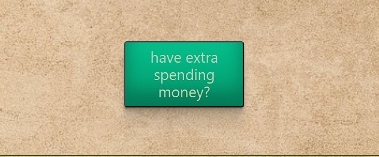

# Welcome to Piggy Funds
```
This a simple expense tracker. An easy way to keep track of how you manage your money. If your bad at budgeting or even saving this will help you keep track of those expesne that aren't really nessaary. For people who are learning to manage there small bussines or even want to save for investing this will also help! API will be inccluded to point you in the right direction with the extra money you saved up.
```

## User story
```
Who are we building for? Anyone that want's to keep track of expenses.
What do they want? Bill management, accountability for expenses, planning future expenses
Benefit of Application: keeping your expenses organized, possible financial freedom, buying with confidence

```
## Acceptance Criteria
```
Given I am using an expense tracker
I will enter my monthly budget
When I click on the drop down menu
Then I am presented with said payments
When I choose a type of payment
I can click on a date, by being presented with a drop down menu of years, days, and month to choose from
When I click in the Name box
I can name the payment I am referring to by giving it a title
When I click on amount
Then I can type in any amount
When I click add a new expense
Then the application will be entered above
When I come back to My Expense Tracker
I can view, add or update My Expense Tracker

Given my expense tracker is up-dated
When I can view my spending money
I can read up on trending investments articles, I can shop, and I can reserach crypto investments.
Then I can use the remaining money however I choose. 

```
# Lets Manage that money!
```
Our website will Help you keep track of your monthly expenses. Just start off by Putting your Budget for the month!
```

```
Then follow the form by Choosing your type of expense, the date, name and amount!
```

```
Once you press enter your expense will be added to the the list below.
```

```
If you see you have extra spending money for yourself or your bussness you can visit clcik on the Have extra speading money? 
```

```
once you follow the link it will show you stocks or investment you can use your money towards of if your a small bussiness owner looking for supplies it will take you to websites that sell supplies.
```


## Credits 
```
Thank you to the amazing team! 
Lisa Ridner
Marilys Valentin
Samuel DeJesus
Richard Murillo
Jai Lawson
```
## License
```
MIT License

Copyright (c) [2023] [Marilys Valentin, Lisa Ridner, Samuel DeJesus, Jai Lawson, Richard Murillo ]

Permission is hereby granted, free of charge, to any person obtaining a copy
of this software and associated documentation files (the "Software"), to deal
in the Software without restriction, including without limitation the rights
to use, copy, modify, merge, publish, distribute, sublicense, and/or sell
copies of the Software, and to permit persons to whom the Software is
furnished to do so, subject to the following conditions:

The above copyright notice and this permission notice shall be included in all
copies or substantial portions of the Software.

THE SOFTWARE IS PROVIDED "AS IS", WITHOUT WARRANTY OF ANY KIND, EXPRESS OR
IMPLIED, INCLUDING BUT NOT LIMITED TO THE WARRANTIES OF MERCHANTABILITY,
FITNESS FOR A PARTICULAR PURPOSE AND NONINFRINGEMENT. IN NO EVENT SHALL THE
AUTHORS OR COPYRIGHT HOLDERS BE LIABLE FOR ANY CLAIM, DAMAGES OR OTHER
LIABILITY, WHETHER IN AN ACTION OF CONTRACT, TORT OR OTHERWISE, ARISING FROM,
OUT OF OR IN CONNECTION WITH THE SOFTWARE OR THE USE OR OTHER DEALINGS IN THE
SOFTWARE.
