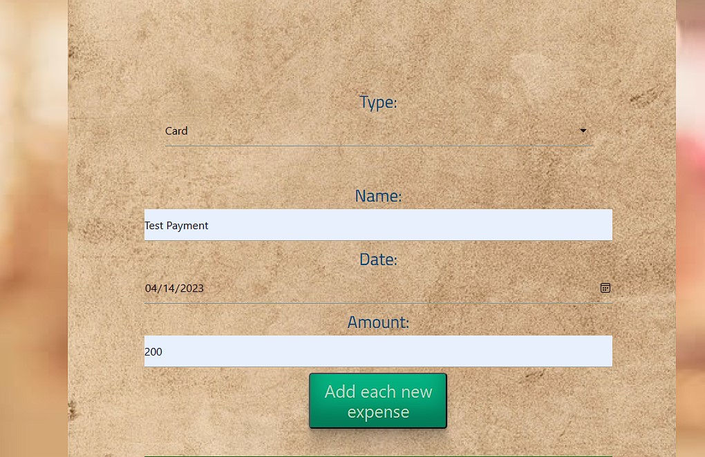
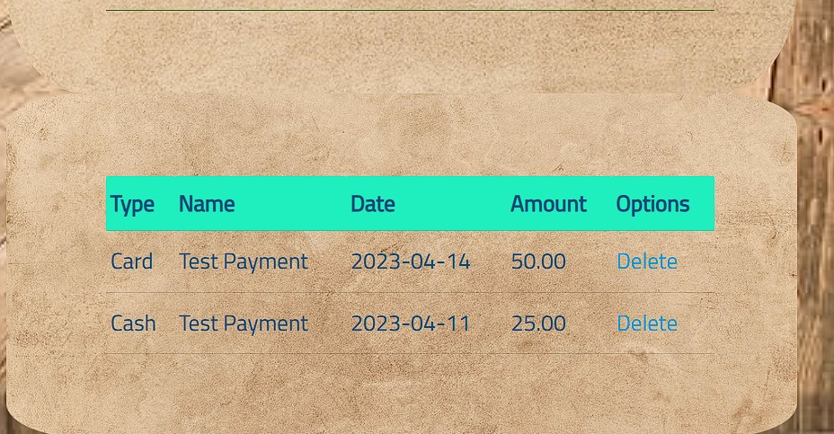

# Welcome to our Expense Tracker

## User story
```
Who are we building for? Anyone that want's to keep track of expenses.
What do they want? Bill management, accountability for expenses, planning future expenses
Benefit of Application: keeping your expenses organized, possible financial freedom, buying with confidence

```
## Acceptance Criteria
```
Given I am using an expense tracker
I will enter my monthly budget
When I click on the drop down menu
Then I am presented with said payments
When I choose a type of payment
I can click on a date, by being presented with a drop down menu of years, days, and month to choose from
When I click in the Name box
I can name the payment I am referring to by giving it a title
When I click on amount
Then I can type in any amount
When I click add a new expense
Then the application will be entered above
When I come back to My Expense Tracker
I can view, add or update My Expense Tracker

Given my expense tracker is up-dated
When I can veiw my spending money
Then I can use reminding money to check shops or invest.


```
# Lets Manage the money!
```
Our website will Help you keep track of your monthly expenses. Just start off by Putting your Budget for the month!
```

```
Then follow the form by Choosing your type of expense, the date, name and amount!
```

```
Once you press enter your expense will be added to the the list below.
```

```
